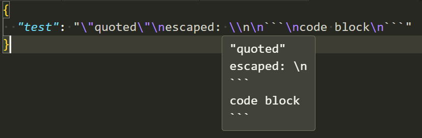

# string-hover

VSCode extension to show string values on hover.

This is useful to inspect the unescaped value for escaped strings (e.g. `\n`, `\\` and `\"`).

## Supported Languages

- JSON (`*.json`)
- JSON with comments (`*.jsonc`)

## Contributing

Welcome to contribute by creating issues or sending pull requests (e.g. adding support for more languages).

## [CHANGELOG](https://github.com/DiscreteTom/string-hover/blob/main/CHANGELOG.md)
